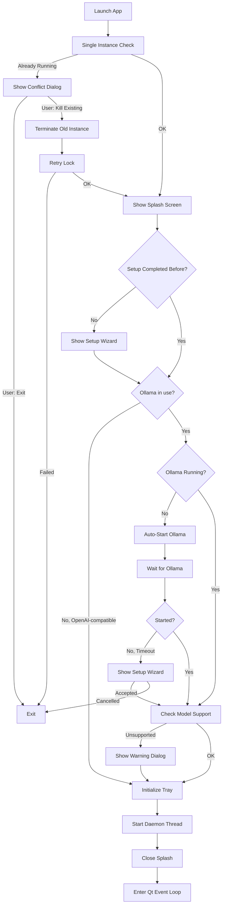
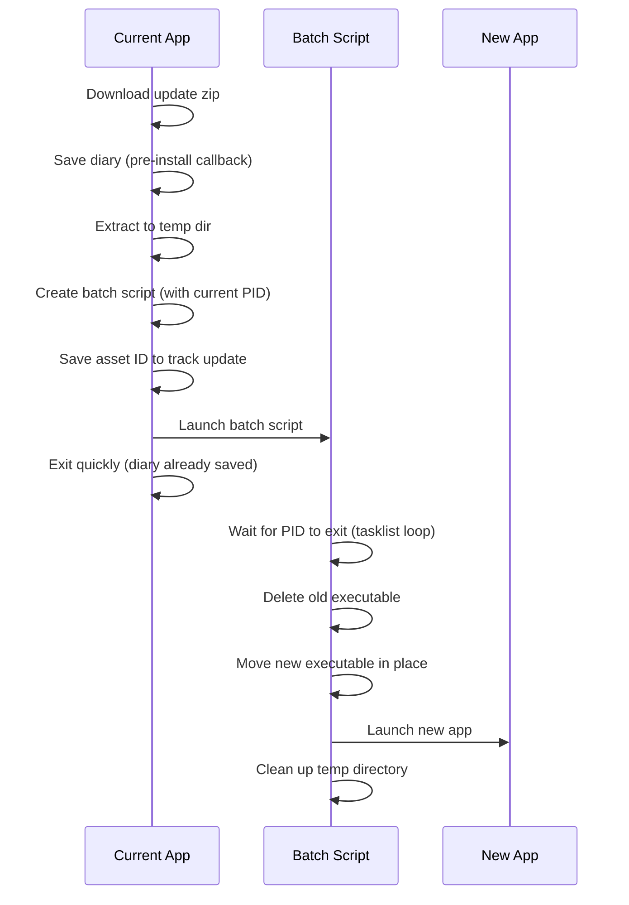

# Desktop App Specification

This document outlines the architecture and behavior of the Jarvis Desktop App - a cross-platform PyQt6 system tray application that provides a graphical interface for the Jarvis voice assistant.

## Overview

The desktop app is a **separate package** from the core `jarvis` module. It depends on `jarvis` for assistant functionality but `jarvis` has no knowledge of or dependency on the desktop app. This separation allows:

- Running Jarvis headless (CLI/daemon only)
- Building alternative UIs (web, mobile) without modifying core logic
- Keeping PyQt6 dependencies isolated from the core package

## Package Structure

```
src/desktop_app/
├── __init__.py          # Package exports, main() entry point
├── app.py               # JarvisSystemTray, windows, startup flow
├── splash_screen.py     # Animated startup splash
├── setup_wizard.py      # First-run setup wizard
├── settings_window.py   # Auto-generated settings UI from config metadata
├── face_widget.py       # Animated face visualization
├── themes.py            # Qt stylesheets and color palette
├── diary_dialog.py      # End-of-session diary update dialog
├── memory_viewer.py     # Flask-based memory browser
├── updater.py           # Update checking logic
├── update_dialog.py     # Update notification dialogs
└── desktop_assets/      # Icons and images
```

## Startup Flow

The startup sequence ensures a smooth user experience even when dependencies (like Ollama) aren't ready.



### Key Startup Features

1. **Splash Screen**: Shows immediately to provide visual feedback while loading
2. **Provider-aware Ollama gating** (`_ollama_runtime_flags` in `app.py`): The Ollama server-start and model-verification steps run only when a local provider actually uses Ollama. A pure OpenAI-compatible setup (chat and embeddings both remote) skips them entirely. `get_required_models()` is provider-aware, so model verification pulls exactly the models that run locally: chat + intent-judge when chat is on Ollama, and the embedding model when embeddings are on Ollama. When chat is on Ollama, a missing model opens the setup wizard; when only embeddings are local (remote chat), a missing embedding model surfaces a clear non-blocking instruction (memory search falls back to keyword matching until it is pulled). The unsupported-chat-model check runs only on the Ollama chat path. `should_show_setup_wizard()` returns False for an OpenAI-compatible chat provider.
3. **Ollama Auto-Start**: When Ollama is in use and not running, automatically starts it (up to 15s wait). If the wait times out, the setup wizard opens so the user can diagnose connectivity; cancelling the wizard exits the app.
3a. **OpenAI-compatible reachability check** (`_check_openai_compat_reachable` in `app.py`): Jarvis cannot start a third-party server the way it starts Ollama, so on a pure OpenAI-compatible setup it checks the server answers `GET /v1/models` and, if not, shows a one-off warning naming the address (never the API key) and pointing to Settings, then continues. The user only otherwise discovers a down server when their first request fails.
4. **Single Instance Lock**: Prevents multiple copies from running simultaneously. If another instance is detected, shows a dialog offering to close the existing instance and start fresh.
5. **Crash Detection**: Detects previous crashes and offers to submit bug reports

### CLI Flags

| Flag | Purpose |
|------|---------|
| `--smoke-test` | CI smoke-test mode. Creates a minimal offscreen QApplication, runs the daemon initialisation (`daemon.main(smoke_test=True)`), prints `SMOKE_TEST_PASSED` on success (or the error + traceback on failure), and exits with code 0 or 1. Forces UTF-8 stdout/stderr on every OS (emoji-safe even when the console is an ANSI code page or absent) and Qt's offscreen platform on Linux so the gate never depends on xvfb/xcb. Bypasses the single-instance lock, crash detection, splash screen, setup wizard, Ollama checks, model verification, tray icon, and event loop. Used by the `release-smoke.yml` workflow to verify the bundled binary starts without missing DLLs or broken imports before fast-forwarding `main` to `develop`. |

## Main Components

### JarvisSystemTray

The central controller that manages:

- **System tray icon** with context menu
- **Daemon lifecycle** (start/stop the Jarvis voice assistant)
- **Window management** (log viewer, memory viewer, face window)
- **Update checking** on startup and on-demand

### Windows

| Window | Purpose |
|--------|---------|
| **LogViewerWindow** | Real-time log output from the daemon, with "Report Issue" button |
| **MemoryViewerWindow** | Web-based memory browser (Flask server) |
| **FaceWindow** | Animated face that reacts to speaking state |
| **SettingsWindow** | Auto-generated config editor with tabbed categories |
| **SetupWizard** | First-run configuration (Ollama, models, profile) |
| **DictationHistoryWindow** | Scrollable list of past dictations with copy/delete/clear actions |

### Tray Menu: GPU Library Recovery (Windows)

`cuda_recovery.py` exposes the `🎮 Reinstall GPU libraries` action. The tray adds it only when running on Windows, an NVIDIA driver is detected (`%SystemRoot%\System32\nvcuda.dll` exists), and the bundled `install_cuda.ps1` script is on disk. Clicking it confirms with the user, then re-runs `install_cuda.ps1` via `ShellExecuteW` with the `runas` verb so UAC elevates the process before it writes into `Program Files\Jarvis\cuda`. This is the only user-facing recovery path when the original Inno Setup install of cuBLAS/cuDNN fails — the installer's own task fires once per install and the script's marker file used to make subsequent reinstalls skip the CUDA step. The runtime probe in `jarvis.listening.listener._print_cuda_unavailable_hint` points users at this action by name when it falls back to CPU.

The Inno Setup script also runs a `VerifyCudaInstall` hook after the CUDA download task completes. The hook checks for the `.cuda_installed` marker (which `install_cuda.ps1` only writes after every expected DLL is present and SHA-verified) and surfaces a `MsgBox` pointing at `{app}\cuda\install.log` and the tray recovery action when the marker is missing. This is what makes a hidden install failure visible to the user instead of letting the installer report success on a half-installed CUDA tree.

### DictationHistoryWindow Behaviour

- **Backing store**: File-backed via `DictationHistory` (`src/jarvis/dictation/history.py`); entries are newest-first with `id`, `text`, `timestamp`, `duration`. Disk is the source of truth — the window must not assume its in-memory instance is authoritative.
- **Hidden windows are inert**: Signals from the dictation engine must not mutate the widget tree while the window is hidden; pending entries are surfaced on next open instead. The engine persists entries regardless, so no data is lost.
- **On show, reload from disk and rebuild**: The window reads disk state on every show, because the daemon may be in a separate process (subprocess mode) or may have recorded entries while the window was hidden (bundled mode). In-memory state alone is not trusted.
- **While visible, poll for external writes**: A short interval timer watches the history file's mtime and reloads on change so subprocess-mode dictations appear without requiring a re-open.
- **Rebuilds replace the container**: `_reload()` builds a fresh list container and installs it into the scroll area via `takeWidget()` + `setWidget()`; the previous container is hidden and `deleteLater()`'d. This atomic swap sidesteps every class of orphan-during-paint issue that surgical layout edits invite.
- **Reload deferred off showEvent**: `showEvent` schedules the rebuild via `QTimer.singleShot(0, ...)` rather than mutating the widget tree inline, so the first paint pass sees a stable tree.
- **No emoji codepoints in `strftime` format strings**: On Windows with the bundled Python 3.11, `datetime.strftime` routes through the C locale encoder and raises `UnicodeEncodeError` on non-BMP codepoints (e.g. 📅). When that exception escapes a Qt slot invocation, Qt6Core triggers a fast-fail (0xc0000409) and the whole app dies. Build timestamp labels by interpolating emoji outside `strftime`.

### LogViewerWindow Features

- Real-time log streaming from daemon
- Monospace font for readability (JetBrains Mono on macOS, Consolas elsewhere)
- **Report Issue button**: Opens GitHub issue with:
  - Pre-filled bug report template
  - Auto-redacted log contents (emails, tokens, JWTs, passwords, etc.)
  - Logs in collapsible `<details>` section
  - Version and platform info
  - Log truncation preserves the init section (everything up to the last `─`×50 separator) + recent tail (most useful for debugging); middle lines are truncated

### Splash Screen

Animated loading screen shown during startup with:

- Pulsing orb animation (matches theme colors)
- Status text updates ("Checking Ollama...", "Starting daemon...")
- Frameless, centered, always-on-top

## Daemon Integration

The desktop app runs the Jarvis daemon in a **QThread** (bundled mode) or **subprocess** (development mode).

```
┌─────────────────────────────────────────┐
│           Desktop App (Main Thread)      │
│  ┌─────────────────────────────────┐    │
│  │         Qt Event Loop            │    │
│  │  - Tray icon interactions        │    │
│  │  - Window management             │    │
│  │  - Signal/slot communication     │    │
│  └─────────────────────────────────┘    │
│                   │                      │
│                   │ signals              │
│                   ▼                      │
│  ┌─────────────────────────────────┐    │
│  │      DaemonThread (QThread)      │    │
│  │  - Runs jarvis.daemon.main()     │    │
│  │  - Captures stdout/stderr        │    │
│  │  - Emits logs to LogViewer       │    │
│  └─────────────────────────────────┘    │
└─────────────────────────────────────────┘
```

### Daemon Callbacks

The desktop app registers callbacks with the daemon for:

- **Diary updates**: Shows DiaryUpdateDialog when session ends
- **Clean shutdown**: Ensures graceful exit with diary save

#### Bundled Mode (QThread)

In bundled mode, the daemon runs in the same process, so callbacks can be set directly via `set_diary_update_callbacks()`. The DiaryUpdateDialog receives:
- `on_chunks`: List of conversation chunks being summarized
- `on_token`: Streaming tokens as the diary is generated
- `on_status`: Status messages ("Writing diary entry...")
- `on_complete`: Completion signal (success/failure)

#### Subprocess Mode (Development)

In subprocess mode, the daemon runs as a separate process. IPC is achieved via stdout:
- Daemon emits JSON events prefixed with `__DIARY__:` (e.g., `__DIARY__:{"type":"token","data":"Hello"}`)
- Desktop app intercepts these lines from the log stream
- DiaryUpdateDialog's `process_log_line()` parses and emits signals
- Same UI experience as bundled mode

## Theme System

All UI components use a consistent dark theme defined in `themes.py`:

```python
COLORS = {
    "bg_primary": "#09090b",      # Deep space black
    "bg_secondary": "#18181b",    # Slightly lighter
    "accent_primary": "#f59e0b",  # Amber
    "accent_secondary": "#fbbf24", # Lighter amber
    "text_primary": "#fafafa",    # White
    "text_secondary": "#a1a1aa",  # Muted
    ...
}
```

Components use `JARVIS_THEME_STYLESHEET` for consistent styling across all dialogs and windows.

### No remote assets

Every surface renders from local resources only — no CDN webfonts, scripts,
styles, or `preconnect` hints. This binds hardest on the Memory Viewer, which
is HTML and could trivially pull a webfont: that page shows the user's diary
and personal facts, so a font request would disclose their IP, User-Agent and
the time they opened it, and would degrade the design on an offline machine.
Typography goes through the `--font-ui` / `--font-mono` custom properties,
which prefer the design's faces when installed locally and fall back to
system faces ending in a generic family. Guarded by
`tests/test_memory_viewer_offline.py`.

## Update System

The desktop app includes an auto-update mechanism:

1. **Check**: Queries GitHub releases API for newer versions
2. **Notify**: Shows dialog with changelog and download option
3. **Download**: Downloads new installer with progress bar
4. **Install**: Platform-specific installation (see below)

Updates are only available in bundled mode (PyInstaller builds).

### Platform-Specific Update Installation

| Platform | Strategy |
|----------|----------|
| **macOS** | Extracts the update zip with `ditto -x -k` (Python's `zipfile` drops the symlinks Qt/Qt WebEngine frameworks rely on, producing a bundle macOS refuses to launch with "Jarvis.app can't be opened"; the release workflow creates the zip with the matching `ditto -c -k --keepParent`). Falls back to `zipfile.extractall` only when `/usr/bin/ditto` is missing — i.e. unit tests on Linux CI; production macOS always ships ditto, so the fallback never runs in the field. Then creates a shell script that waits for the current process (by PID via `kill -0`) to exit, moves the old `.app` aside to `Jarvis.app.backup` (one-generation rollback), moves the new bundle in, strips `com.apple.quarantine` so Gatekeeper doesn't re-prompt on unsigned builds, re-registers the swapped bundle with `lsregister -f` (LaunchServices caches the old inode across the `mv` and a bare `open` silently no-ops otherwise), relaunches with `open -n`, and falls back to execing the bundle's inner binary via `nohup` if `open` fails. Script output is captured to `~/Library/Logs/Jarvis/updater.log` (size-capped) so detached failures leave a diagnostic trail. The executable name is read from the new bundle's `CFBundleExecutable`, not hardcoded. No Finder/AppleScript automation. Pattern mirrors Squirrel.Mac's `ShipIt` helper. |
| **Windows** | Creates a batch script that waits for the current process (by PID via `tasklist`) to exit, then runs the Inno Setup installer with `/SILENT` so the installer's own progress window provides visual feedback during install, then relaunches the upgraded exe. Rollback is handled by Inno Setup's own in-session rollback + retained uninstaller data. |
| **Linux** | Creates a shell script that waits for the current process (by PID via `kill -0`) to exit, moves the old directory to `Jarvis.backup` for rollback, moves the new directory in, and relaunches |

### Update Flow (Windows/Linux)



### Important Notes

- **Diary is saved before update installation**: The `pre_install_callback` mechanism ensures the diary is saved before the update process begins, so no data is lost
- **Commit-based detection (develop)**: For develop channel updates (where the release version stays "latest"), the installed build's commit — stamped as `dev-<sha>` in `_version.py` by CI (`dev-<full sha>`) or `scripts/build_installer.*` (`dev-<7-hex sha>`) — is compared against the commit the latest release was built from (`**Commit**: <sha>` in the release body, added by `release.yml`). Only a mismatched commit shows the update prompt, so a fresh install from the release page or a CI re-upload of the same commit no longer triggers it. When either side can't be determined (e.g. a `dev-local` source run, or a release published without the commit stamp), the updater falls back to tracking the GitHub asset ID
- **Robust Windows update**: The batch script waits for the actual process to exit (by PID) rather than using a fixed timeout, ensuring the update doesn't fail due to slow shutdown
- **Visible Windows install progress**: The Inno Setup installer runs with `/SILENT` (not `/VERYSILENT`) so its own progress window is visible while the install runs — bridging the gap between the download dialog closing and the new app launching, which would otherwise look like a hang
- **Quarantine stripping (macOS)**: The shell script runs `xattr -dr com.apple.quarantine` on the newly-installed bundle. Builds are unsigned (ad-hoc signing breaks Qt WebEngine's symlinks — see `release.yml`), so without this step Gatekeeper may re-trigger the "unidentified developer" prompt on every update
- **One-generation rollback (macOS, Linux)**: The previous `.app` / directory is moved aside to `<name>.backup` rather than deleted outright, so a user can restore the prior version manually if the new one fails to launch. The backup from the previous update is cleared before creating a new one, so at most one backup exists on disk at a time. This is a simplified version of Squirrel's versioned-folder rollback — enough safety for a single-bundle install, without the architectural overhead

## Memory Viewer

A Flask-based web interface for browsing conversation history:

- Runs on `localhost:5050`
- **Bundled mode**: Flask runs in a daemon thread
- **Development mode**: Flask runs as subprocess
- Opens in embedded QWebEngineView or system browser (macOS fallback)

## Error Handling

### Crash Detection

1. On startup, creates a `.crash_marker` file
2. On clean exit, removes the marker
3. On next startup, if marker exists → previous session crashed
4. Offers to submit crash report to GitHub Issues

### Fallbacks

- **No Ollama**: Shows setup wizard or auto-starts
- **No WebEngine**: Opens memory viewer in system browser
- **Model not supported**: Warning dialog with option to change
- **Update failed**: Error dialog with details

## Platform-Specific Behavior

| Feature | macOS | Windows | Linux |
|---------|-------|---------|-------|
| Tray icon | Native menu bar | System tray | System tray |
| Ollama start | `open -a Ollama` | `ollama serve` (hidden) | `ollama serve` |
| Crash logs | `~/Library/Logs/Jarvis` | `%LOCALAPPDATA%\Jarvis` | `~/.jarvis` |
| Memory viewer | System browser* | Embedded WebEngine | Embedded WebEngine |

*macOS bundled apps use system browser due to QtWebEngine sandbox issues.

## File Locations

| File | macOS | Windows | Linux |
|------|-------|---------|-------|
| Config | `~/.config/jarvis/` | `%APPDATA%\jarvis\` | `~/.config/jarvis/` |
| Database | `~/.local/share/jarvis/` | `%LOCALAPPDATA%\jarvis\` | `~/.local/share/jarvis/` |
| Crash logs | `~/Library/Logs/Jarvis/` | `%LOCALAPPDATA%\Jarvis\` | `~/.jarvis/` |
| Instance lock | `~/Library/Application Support/Jarvis/` | `%LOCALAPPDATA%\Jarvis\` | `~/.jarvis/` |
